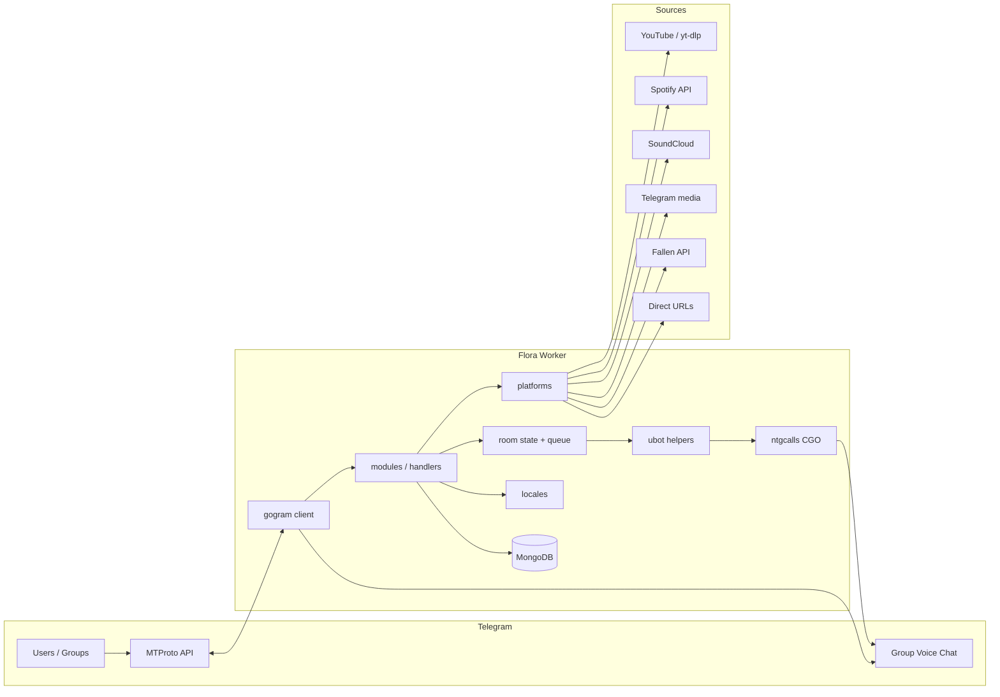
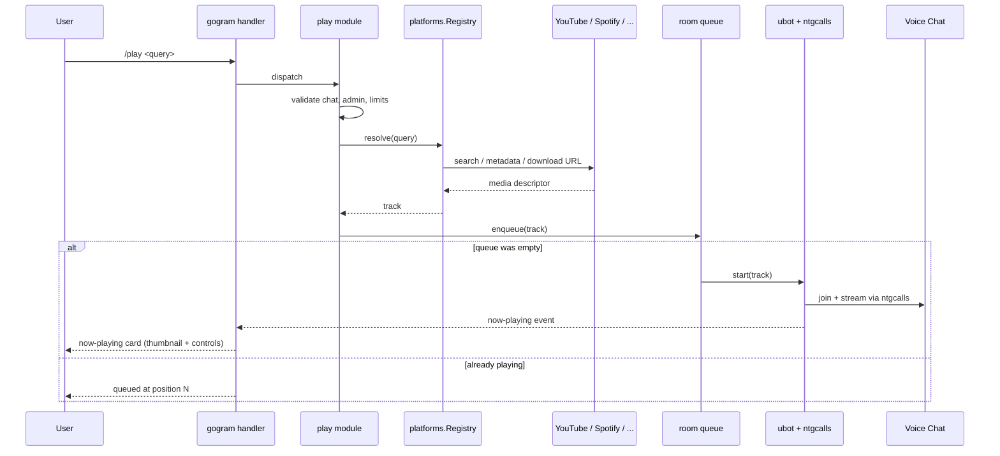

<h1 align="center">
  <br>
  
  <br>
  Flora Music Bot
  <br>
</h1>

<p align="center">
  <strong>A performant, CGO-powered Telegram music bot written in Go — streams YouTube, Spotify, SoundCloud, Telegram media and direct URLs into group voice chats with full queue, playback and admin control.</strong>
</p>

<p align="center">
  
  
  
  
  
  
  
  
  
  
</p>

<p align="center">
  <a href="#sparkles-highlights">Highlights</a>&nbsp;&nbsp;&nbsp;|&nbsp;&nbsp;&nbsp;
  <a href="#fire-why-flora-feels-different">Why Flora</a>&nbsp;&nbsp;&nbsp;|&nbsp;&nbsp;&nbsp;
  <a href="#art-architecture">Architecture</a>&nbsp;&nbsp;&nbsp;|&nbsp;&nbsp;&nbsp;
  <a href="#rocket-commands">Commands</a>&nbsp;&nbsp;&nbsp;|&nbsp;&nbsp;&nbsp;
  <a href="#computer-stack">Stack</a>&nbsp;&nbsp;&nbsp;|&nbsp;&nbsp;&nbsp;
  <a href="#package-quick-start">Quick Start</a>&nbsp;&nbsp;&nbsp;|&nbsp;&nbsp;&nbsp;
  <a href="#wrench-developer-commands">Dev</a>&nbsp;&nbsp;&nbsp;|&nbsp;&nbsp;&nbsp;
  <a href="#memo-project-notes">Notes</a>
</p>

<br>

> [!NOTE]
> Flora is the Go rewrite of the original Python `WinxMusic` bot. The project links against the GPL-licensed
> [`ntgcalls`](https://github.com/pytgcalls/ntgcalls) shared library via CGO, so builds require a C toolchain and
> FFmpeg on the runtime host.

## :sparkles: Highlights

### Telegram Voice Chat Streaming

- **Native group call streaming** powered by `libntgcalls` through Go CGO bindings
- **Video streaming** in video chats (`/vplay`, `/cvplay`)
- **Channel playback** that targets a linked channel from a group (`/cplay`, `/cfplay`)
- **RTMP ingest** for pushing external live streams into a call (`/stream`, `/rtmp`)
- **Auto-leave** when demoted or kicked, optional per-instance
- **Force-play** variants that preempt the current track (`/fplay`, `/fvplay`, …)

### Multi-Platform Sources

- **YouTube** (videos, playlists, search) via `yt-dlp` with cookie rotation
- **Spotify** metadata resolution (tracks, albums, playlists) — audio sourced through the YouTube resolver
- **SoundCloud** tracks and playlists
- **Telegram** audio/video replies — play directly from forwarded media
- **Direct streams** — any URL that FFmpeg can eat (HLS, MP3, radio, etc.)
- **Fallen API** optional downloader as a cookie-free fallback for YouTube

### Queue & Playback Control

- **Full queue model** with shuffle, loop, jump, move, remove, clear, position
- **Seek / seekback / speed** controls on the live stream
- **Pause / resume / mute / unmute / replay / skip / stop** — the whole playback surface
- **Per-chat limits** — `DURATION_LIMIT`, `QUEUE_LIMIT`, `MAX_AUTH_USERS`
- **Thumbnails** generated on the fly for the now-playing card

### Admin, Ops & Extensibility

- **Sudoers system** with owner + sudo roles, auth-users per chat
- **Broadcast** to every served chat/user, with pinning and forwarding modes
- **Logger channel** for joins, leaves, plays and errors
- **Maintenance mode** to lock the bot down during deploys
- **Live eval** (`/ev`) and embedded scripting via [`yaegi`](https://github.com/traefik/yaegi) for dev commands
- **Shell passthrough** (`/bash`, `/sh`) for owner-only ops
- **Speedtest** and **stats** (uptime, CPU, memory, served chats) out of the box
- **pprof HTTP endpoint** wired up for profiling

### Internationalization

- **5 locales bundled**: English, Portuguese (BR), Arabic, Hindi, Turkish
- **Per-chat language** stored in Mongo with `/lang`
- **YAML-based** translation files under `internal/locales/`

## :fire: Why Flora Feels Different

Flora is not a thin wrapper on top of py-tgcalls. It is a **from-scratch Go rewrite** of a mature Python music bot,
built around `gogram` for MTProto and `ntgcalls` via CGO for WebRTC. The result is a single statically-linked worker
binary with predictable memory, real `go test` coverage hooks, native concurrency for the queue/player goroutines,
and a clean `internal/` layout where **every subsystem is a testable package** instead of a tangle of Pyrogram
plugins.

The bot keeps every feature the Python version shipped — playlists, channel play, video chat, RTMP, multi-locale,
admin controls, live eval — and adds the operational upside of a compiled service: smaller containers, faster cold
starts, and proper dependency hygiene through Go modules.

## :art: Architecture



### Playback Request Flow



<details>
<summary><strong>Packages worth knowing</strong></summary>

| Area                    | Main packages                           |
|-------------------------|-----------------------------------------|
| Entrypoint + CGO        | `cmd/app`                               |
| Env / runtime config    | `internal/config`                       |
| Bot bootstrap + clients | `internal/core`, `internal/core/models` |
| Command handlers        | `internal/modules`                      |
| Source resolution       | `internal/platforms`                    |
| Persistence             | `internal/database` (MongoDB v2 driver) |
| i18n                    | `internal/locales`                      |
| YouTube cookies storage | `internal/cookies`                      |
| Helpers / formatting    | `internal/utils`                        |
| libntgcalls Go bindings | `ntgcalls/`                             |
| User-bot + group calls  | `ubot/`                                 |

</details>

## :rocket: Commands

> ~90 commands across playback, queue, admin and dev surfaces. Every command supports `-h` / `--help` inline.

### Playback

| Command                                   | Description                                 |
|-------------------------------------------|---------------------------------------------|
| `/play <query\|url>`                      | Search and play a track in the voice chat   |
| `/fplay`, `/playforce`                    | Force-play, bypassing the queue             |
| `/vplay`, `/fvplay`                       | Play as video stream                        |
| `/cplay`, `/cfplay`                       | Play in a linked channel's voice chat       |
| `/vcplay`, `/fvcplay`                     | Play video in a linked channel's voice chat |
| `/stream`, `/streamstop`, `/streamstatus` | RTMP stream management                      |
| `/rtmp`, `/setrtmp`                       | Configure RTMP input                        |
| `/replay`                                 | Restart the current track                   |

### Queue & Controls

| Command                       | Description                       |
|-------------------------------|-----------------------------------|
| `/skip`                       | Skip the current track            |
| `/pause`, `/resume`           | Pause / resume playback           |
| `/mute`, `/unmute`            | Mute / unmute the bot in the call |
| `/seek`, `/seekback`, `/jump` | Seek forward / back / to position |
| `/pos`, `/position`           | Show playback position            |
| `/queue`, `/clear`            | Show / clear the queue            |
| `/remove`, `/move`            | Remove / move a queue item        |
| `/shuffle`, `/loop`           | Shuffle queue / loop track        |
| `/speed`, `/setspeed`         | Change playback speed             |
| `/end`, `/stop`               | Stop playback and leave           |

### Admin & Ops

| Command                                      | Description                            |
|----------------------------------------------|----------------------------------------|
| `/start`, `/help`, `/ping`, `/stats`         | Basic info                             |
| `/lang`, `/language`                         | Change chat language                   |
| `/auth`, `/addauth`, `/delauth`, `/authlist` | Manage chat auth users                 |
| `/autoleave`                                 | Toggle auto-leave on demote/kick       |
| `/bug`                                       | Report a bug to the support chat       |
| `/active`, `/activevc`                       | List active voice chats                |
| `/maintenance`, `/maint`                     | Toggle maintenance mode (sudo)         |
| `/logger`                                    | Toggle the logger channel (sudo)       |
| `/broadcast`, `/gcast`                       | Broadcast to served chats/users (sudo) |
| `/log`, `/logs`                              | Fetch runtime logs (sudo)              |
| `/reload`, `/restore`                        | Reload handlers / restore state        |
| `/addsudo`, `/delsudo`, `/sudoers`           | Manage sudoers (owner)                 |

### Developer

| Command              | Description                               |
|----------------------|-------------------------------------------|
| `/eval`, `/ev`       | Evaluate Go expressions via yaegi (owner) |
| `/bash`, `/sh`       | Run shell commands (owner)                |
| `/json`              | Dump the raw update object                |
| `/restart`           | Restart the worker (owner)                |
| `/speedtest`, `/spt` | Run a speedtest from the host             |

## :computer: Stack

### Runtime

| Technology          | Version  | Role                                   |
|---------------------|----------|----------------------------------------|
| Go                  | `1.25+`  | Application runtime                    |
| CGO + `libntgcalls` | latest   | WebRTC bridge for Telegram group calls |
| FFmpeg              | required | Transcoding + stream shaping           |
| yt-dlp              | latest   | YouTube / generic extractor            |
| Deno                | optional | Runtime for a few JS-based extractors  |

### Go dependencies

| Module                                               | Role                              |
|------------------------------------------------------|-----------------------------------|
| `github.com/amarnathcjd/gogram`                      | MTProto / userbot / bot client    |
| `github.com/Laky-64/gologging`                       | Structured logging                |
| `go.mongodb.org/mongo-driver/v2`                     | Mongo persistence                 |
| `github.com/zmb3/spotify/v2` + `golang.org/x/oauth2` | Spotify metadata                  |
| `github.com/shirou/gopsutil/v3`                      | Host stats                        |
| `github.com/showwin/speedtest-go`                    | `/speedtest`                      |
| `github.com/traefik/yaegi`                           | Embedded Go interpreter for `/ev` |
| `github.com/joho/godotenv`                           | `.env` loading                    |
| `resty.dev/v3`                                       | HTTP client                       |
| `gopkg.in/yaml.v3`                                   | Locale loading                    |

### Data

| Technology | Status   | Role                          |
|------------|----------|-------------------------------|
| MongoDB    | required | Chats, users, state, settings |

## :package: Quick Start

### Prerequisites

- Go **1.25+**
- `gcc`, `make`, `git`, `unzip`, `curl`, `zlib` (for CGO + `ntgcalls`)
- FFmpeg on `$PATH`
- A MongoDB instance (local or Atlas)
- Telegram API credentials from [my.telegram.org](https://my.telegram.org)
- A bot token from [@BotFather](https://t.me/BotFather)
- At least one Pyrogram/gogram string session for the assistant

### 1. Clone and bootstrap dependencies

```bash
git clone https://github.com/gabrielmaialva33/flora-music-bot.git
cd flora-music-bot
./install.sh --all          # downloads Go, FFmpeg, yt-dlp, Deno, libntgcalls
```

`install.sh` can be run with narrower flags (`--ntgcalls`, `--ytdlp`, …); see `install.sh -h`.

### 2. Configure `.env`

```bash
cp sample.env .env
```

Minimum required values:

- `API_ID` / `API_HASH`
- `TOKEN` (bot token) — `BOT_TOKEN` is accepted as alias
- `MONGO_DB_URI`
- `STRING_SESSIONS` (one or more, separated by space / comma / semicolon)
- `OWNER_ID`
- `LOGGER_ID` (chat id of the logging group/channel)

### 3. Run locally

```bash
go run ./cmd/app
```

### 4. Or build the binary

```bash
CGO_ENABLED=1 go build -trimpath -ldflags="-w -s" -o flora ./cmd/app
./flora
```

### 5. Docker

```bash
docker build -t flora-music-bot .
docker run --rm --env-file .env flora-music-bot
```

The bundled `Dockerfile` is a multi-stage build (`golang:1.26.1-bookworm` → `debian:bookworm-slim` with ffmpeg).

### 6. Heroku

`heroku.yml` + `app.json` are set up for a **container** stack. Push the repo to a Heroku app with
`stack: container` and it will build the worker dyno from the same Dockerfile.

<details>
<summary><strong>Environment checklist</strong></summary>

Important variables from `sample.env`:

- **Core**: `API_ID`, `API_HASH`, `TOKEN`, `MONGO_DB_URI`, `STRING_SESSIONS`, `SESSION_TYPE`,
  `OWNER_ID`, `LOGGER_ID`
- **Limits**: `DURATION_LIMIT`, `QUEUE_LIMIT`, `MAX_AUTH_USERS`
- **Behavior**: `LEAVE_ON_DEMOTED`, `SET_CMDS`, `DEFAULT_LANG`
- **Branding**: `START_IMG_URL`, `PING_IMG_URL`, `SUPPORT_CHAT`, `SUPPORT_CHANNEL`
- **Spotify metadata**: `SPOTIFY_CLIENT_ID`, `SPOTIFY_CLIENT_SECRET`
- **YouTube cookies**: `COOKIES_LINK` (batbin.me URLs, space-separated)
- **Fallen API**: `FALLEN_API_KEY`, `FALLEN_API_URL`

</details>

## :wrench: Developer Commands

```bash
# run locally
go run ./cmd/app

# compile-check every package
go test ./...

# full format stack (what .github/workflows/format.yml runs)
go mod tidy
gofmt -w .
goimports -w .
gci write . -s standard -s default -s "prefix(main)"
gofumpt -w -extra .
golines -w --max-len=90 .

# CPU / memory profiling over the embedded pprof endpoint
go tool pprof http://localhost:<pprof-port>/debug/pprof/profile
```

## :memo: Project Notes

- The repo was migrated from a Python/Pyrogram bot (`WinxMusic`) to this Go rewrite.
  The historical Python tree was removed in the migration commits.
- `ntgcalls/` contains the Go bindings. The **`.so` / `.dll`** shipped by `install.sh` must be present next to the
  binary at runtime (`/app/libntgcalls.so` in the Docker image).
- `/ev` uses `yaegi` to evaluate Go expressions in-process. It is owner-only — do not expose the owner token.
- `COOKIES_LINK` is preferred over bundled `cookies.txt` to avoid leaking YouTube cookies in the repo.
- The license is **GPL** because the project links against GPL-licensed libraries (libntgcalls, gogram).
- `.github/workflows/format.yml` is manually triggered and rebases the formatted result back onto the branch.

## :handshake: Contributing, Security, License

- [AGENTS.md](../AGENTS.md) — repo guide for AI agents / contributors
- [LICENSE](../LICENSE) — GPL
- Issues and PRs are welcome — please include a reproducer and the relevant locale when reporting bugs.

<br>

<p align="center">
  
</p>

<p align="center">
  Crafted by <strong>Gabriel Maia</strong><br>
  <a href="mailto:gabrielmaialva33@gmail.com">gabrielmaialva33@gmail.com</a> ·
  <a href="https://github.com/gabrielmaialva33">GitHub</a>
</p>
